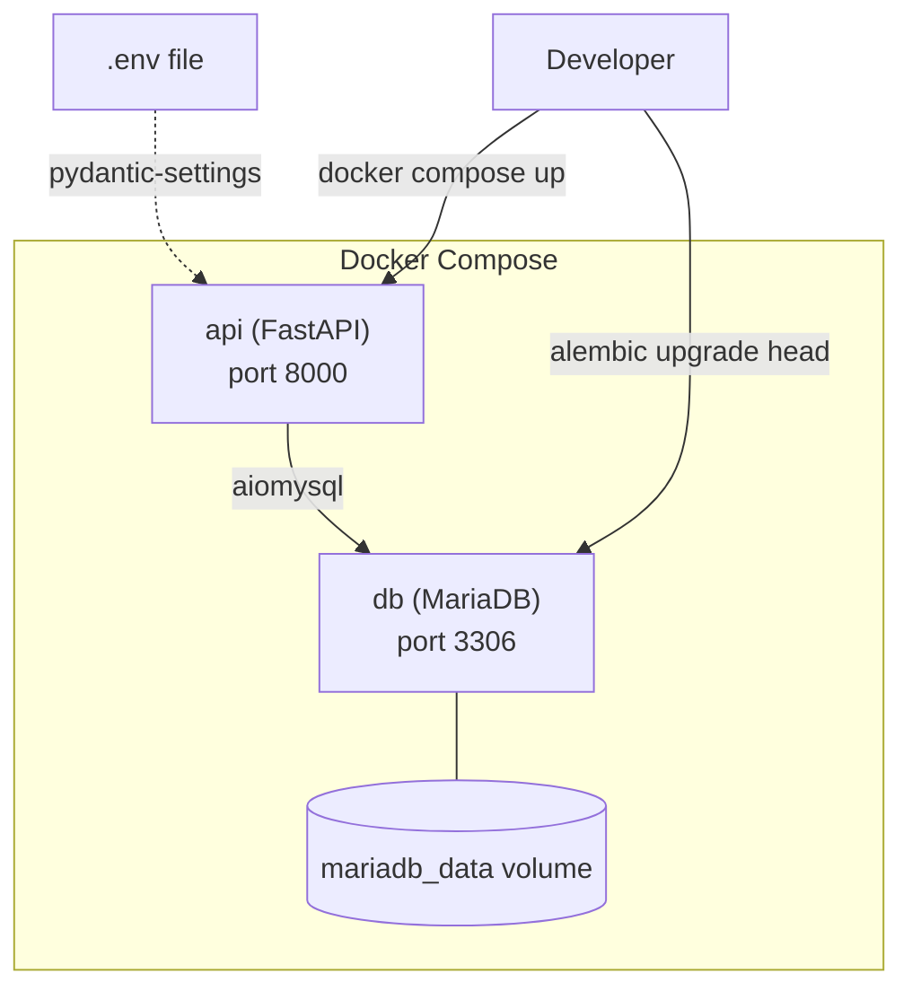

# Technical Design

## Metadata

| Field | Value |
|-------|-------|
| ID | 001 |
| Name | Docker & FastAPI Application Setup |
| Status | APPROVED |
| Author | Tech Lead / AI-assisted |
| Reviewer | |
| Date | 2026-05-12 |
| Approved By | Tech Lead |
| Approval Date | 2026-05-12 |
| Jira Ticket | |

---

## Overview

The application is built as two Docker containers orchestrated by Docker Compose: a FastAPI API service and a MariaDB database. The API service uses a multi-stage Dockerfile (build stage with `uv` for dependency resolution, slim runtime stage with only production packages). Configuration flows through environment variables loaded by pydantic-settings. Database access follows the repository pattern using SQLAlchemy 2.x async engine with `aiomysql`, and schema evolution is managed by Alembic from day one. The full `src/cursor_metrics/` package is scaffolded per the CONSTITUTION file structure with OOP service classes, dependency injection via `Depends()`, and async/await throughout.

---

## Architecture



**Components affected:**

| Component | Change Type | Description |
|-----------|-------------|-------------|
| `Dockerfile` | New | Multi-stage build: uv install stage → slim Python 3.12 runtime |
| `docker-compose.yml` | New | API service + MariaDB service + named volume |
| `.env.example` | New | Documented environment variable template |
| `pyproject.toml` | New | Dependencies, tool config (ruff, pytest, mypy), project metadata |
| `src/cursor_metrics/__init__.py` | New | Package init with `__version__` |
| `src/cursor_metrics/main.py` | New | FastAPI app factory, lifespan handler, router registration |
| `src/cursor_metrics/config.py` | New | `Settings` class via pydantic-settings, loads from env |
| `src/cursor_metrics/database.py` | New | Async SQLAlchemy engine, session factory, `get_db` dependency |
| `src/cursor_metrics/models/__init__.py` | New | Package init, re-exports |
| `src/cursor_metrics/models/metrics.py` | New | Pydantic schemas for ingest payload and responses |
| `src/cursor_metrics/models/db.py` | New | SQLAlchemy ORM table definitions (metrics_events, model_pricing, dashboard_users) |
| `src/cursor_metrics/routers/__init__.py` | New | Package init |
| `src/cursor_metrics/routers/ingest.py` | New | Stub `POST /api/v1/ingest` → 202 Accepted |
| `src/cursor_metrics/routers/reports.py` | New | Stub module placeholder |
| `src/cursor_metrics/routers/auth.py` | New | Stub module placeholder |
| `src/cursor_metrics/routers/dashboard.py` | New | Stub module placeholder |
| `src/cursor_metrics/services/__init__.py` | New | Package init |
| `src/cursor_metrics/services/metrics_service.py` | New | Stub OOP service class |
| `src/cursor_metrics/services/pricing_service.py` | New | Stub OOP service class |
| `src/cursor_metrics/repositories/__init__.py` | New | Package init |
| `src/cursor_metrics/repositories/metrics_repo.py` | New | Stub OOP repository class |
| `src/cursor_metrics/templates/base.html` | New | Jinja2 base layout template |
| `alembic.ini` | New | Alembic configuration pointing to async engine |
| `alembic/env.py` | New | Async migration runner with SQLAlchemy metadata |
| `alembic/versions/001_initial_schema.py` | New | Initial migration: metrics_events, model_pricing, dashboard_users |
| `tests/conftest.py` | New | Pytest fixtures (async client, test DB session) |
| `tests/test_health.py` | New | Health-check endpoint test |
| `tests/test_ingest.py` | New | Stub ingest endpoint test |

---

## Data Model

Three tables per CONSTITUTION database schema:

**metrics_events**

| Column | Type | Constraints |
|--------|------|-------------|
| id | BIGINT | PK, auto-increment |
| event_type | VARCHAR(50) | NOT NULL |
| conversation_id | VARCHAR(255) | NOT NULL |
| generation_id | VARCHAR(255) | NOT NULL |
| model | VARCHAR(100) | NOT NULL |
| user_email | VARCHAR(255) | NOT NULL |
| status | VARCHAR(50) | NOT NULL |
| duration_ms | INT | NULLABLE |
| loop_count | INT | NULLABLE |
| cursor_version | VARCHAR(50) | NULLABLE |
| timestamp | DATETIME | NOT NULL |
| created_at | DATETIME | NOT NULL, server default UTC now |

Indexes: `(user_email, timestamp)`, `(model, timestamp)`, `(conversation_id)`

**model_pricing**

| Column | Type | Constraints |
|--------|------|-------------|
| id | INT | PK, auto-increment |
| model | VARCHAR(100) | UNIQUE, NOT NULL |
| cost_per_input_token | DECIMAL(12,8) | NOT NULL |
| cost_per_output_token | DECIMAL(12,8) | NOT NULL |
| updated_at | DATETIME | NOT NULL, server default UTC now |

**dashboard_users**

| Column | Type | Constraints |
|--------|------|-------------|
| id | INT | PK, auto-increment |
| email | VARCHAR(255) | UNIQUE, NOT NULL |
| password_hash | VARCHAR(255) | NOT NULL |
| created_at | DATETIME | NOT NULL, server default UTC now |

All tables are defined as SQLAlchemy ORM models in `src/cursor_metrics/models/db.py` using `DeclarativeBase`. Alembic auto-generates migrations from these models.

---

## API / Interfaces

**GET /** — Health check

Returns JSON with status, app version, and database connectivity:

```json
{
  "status": "ok",
  "version": "0.1.0",
  "database": "connected"
}
```

If DB is unreachable: `"database": "disconnected"`, HTTP 200 still (health check reports, doesn't fail).

**POST /api/v1/ingest** — Stub ingest

Accepts the telemetry payload schema from CONSTITUTION. Returns `202 Accepted` with empty body. Validates payload via Pydantic model; returns 422 on invalid shape (FastAPI default validation).

**GET /docs** — OpenAPI docs

Enabled by default in FastAPI. No custom configuration needed.

---

## Dependencies

New external packages required in `pyproject.toml`:

| Package | Version | Purpose |
|---------|---------|---------|
| fastapi | ~0.115 | Web framework |
| uvicorn[standard] | ~0.32 | ASGI server |
| sqlalchemy[asyncio] | ~2.0 | Async ORM |
| aiomysql | ~0.2 | Async MySQL/MariaDB driver |
| pydantic-settings | ~2.0 | Environment config |
| alembic | ~1.14 | Database migrations |
| jinja2 | ~3.1 | Template rendering |
| structlog | ~24.0 | JSON structured logging |

Dev dependencies:

| Package | Version | Purpose |
|---------|---------|---------|
| pytest | ~8.0 | Testing |
| pytest-asyncio | ~0.24 | Async test support |
| httpx | ~0.27 | Async test client for FastAPI |
| ruff | ~0.8 | Linting and formatting |
| mypy | ~1.13 | Type checking |

---

## Risks & Tradeoffs

| Risk / Tradeoff | Decision | Rationale |
|-----------------|----------|-----------|
| Alembic adds complexity vs `create_all` | Use Alembic | Schema evolution needs are inevitable; retrofitting migrations later is harder than starting clean |
| Multi-stage Dockerfile increases build complexity | Accept | Production image size and security posture justify the extra Dockerfile lines |
| Stub modules with minimal logic | Accept | Provides correct import structure from day one; avoids refactoring package layout later |

---

## Acceptance Criteria Traceability

| Acceptance Criterion | Addressed By |
|----------------------|--------------|
| `docker compose up` starts app, `GET /` returns health-check | `docker-compose.yml` (API + DB services), `main.py` (app factory + health route), `Dockerfile` (image build) |
| App connects to MariaDB, Alembic migrations create schema | `database.py` (async engine), `alembic/` (migration config + initial migration), `docker-compose.yml` (DB service + volume) |
| `POST /api/v1/ingest` returns 202 | `routers/ingest.py` (stub endpoint), `models/metrics.py` (Pydantic validation schema) |
| `/docs` serves OpenAPI documentation | `main.py` (FastAPI default docs enabled) |
| `src/` has all expected packages and modules | Full component list above — every package/module from CONSTITUTION file structure |
| Env vars loaded from `.env` via pydantic-settings | `config.py` (Settings class), `.env.example` (template), `docker-compose.yml` (env_file directive) |
| `uv run pytest` passes | `tests/conftest.py` + `tests/test_health.py` + `tests/test_ingest.py`, `pyproject.toml` (pytest config) |
| `ruff check` and `ruff format --check` pass | `pyproject.toml` (ruff config), all source files written to comply |
| Dockerfile produces minimal production image | Multi-stage `Dockerfile` (build stage with uv, runtime stage without dev deps) |

---

## Open Questions

None — all technical decisions resolved.
