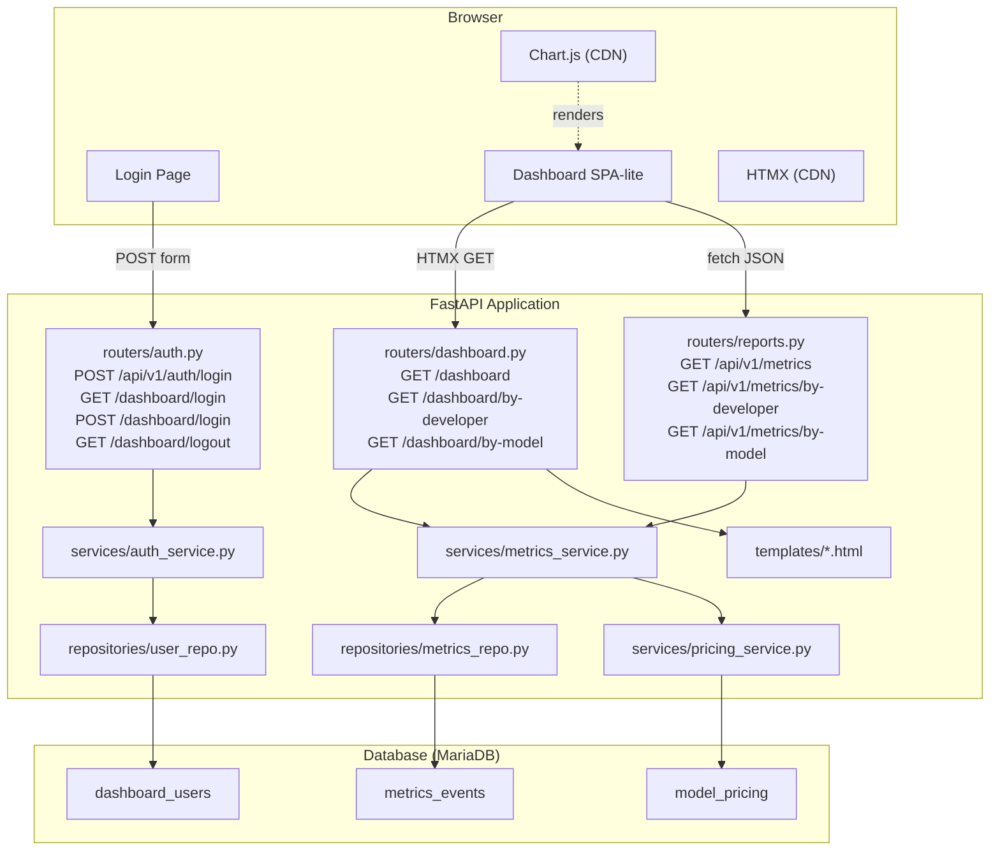

# Technical Design

## Metadata

| Field | Value |
|-------|-------|
| ID | 002 |
| Name | Dashboard Application |
| Status | APPROVED |
| Author | Tech Lead / AI-assisted |
| Reviewer | |
| Date | 2026-05-12 |
| Approved By | Tech Lead |
| Approval Date | 2026-05-12 |
| Jira Ticket | |

---

## Overview

The dashboard is a server-rendered web application within the existing FastAPI service. Authentication uses JWT tokens stored in HTTP-only cookies, with password hashing via `passlib[bcrypt]`. Pages are rendered with Jinja2 templates styled in a dark theme inspired by cursor.com/dashboard, enhanced with HTMX for partial page updates (date filter changes) and Chart.js (CDN) for time-series and distribution charts. Three new API endpoints serve JSON data for the dashboard. The metrics service and repository are implemented with the OOP patterns established in SPEC-001, using SQLAlchemy async queries against the existing `metrics_events` and `model_pricing` tables.

---

## Architecture



**Components affected:**

| Component | Change Type | Description |
|-----------|-------------|-------------|
| `src/cursor_metrics/routers/auth.py` | Modify (stub → impl) | Login page rendering, form handling, JWT cookie set/clear, API login |
| `src/cursor_metrics/routers/dashboard.py` | Modify (stub → impl) | Dashboard pages: overview, by-developer, by-model |
| `src/cursor_metrics/routers/reports.py` | Modify (stub → impl) | JSON API endpoints for metrics data |
| `src/cursor_metrics/services/auth_service.py` | New | JWT creation/verification, password hashing/checking |
| `src/cursor_metrics/services/metrics_service.py` | Modify (stub → impl) | Aggregation queries: daily counts, by-developer, by-model, stat cards |
| `src/cursor_metrics/services/pricing_service.py` | Modify (stub → impl) | Cost estimation from model_pricing table |
| `src/cursor_metrics/repositories/metrics_repo.py` | Modify (stub → impl) | SQLAlchemy async queries against metrics_events |
| `src/cursor_metrics/repositories/user_repo.py` | New | SQLAlchemy queries against dashboard_users |
| `src/cursor_metrics/cli.py` | New | CLI command to create dashboard users |
| `src/cursor_metrics/dependencies.py` | New | `get_current_user` dependency for auth-protected routes |
| `src/cursor_metrics/templates/login.html` | New | Login form page |
| `src/cursor_metrics/templates/dashboard.html` | New | Overview page with stat cards + chart |
| `src/cursor_metrics/templates/by_developer.html` | New | Developer rankings table |
| `src/cursor_metrics/templates/by_model.html` | New | Model usage breakdown |
| `src/cursor_metrics/templates/base.html` | Modify | Add sidebar nav, dark theme CSS, HTMX/Chart.js CDN includes |
| `src/cursor_metrics/templates/partials/stat_cards.html` | New | HTMX partial for stat cards |
| `src/cursor_metrics/templates/partials/chart_data.html` | New | HTMX partial with chart JSON for JS |
| `src/cursor_metrics/main.py` | Modify | Register auth + dashboard + reports routers, add static/template config |
| `pyproject.toml` | Modify | Add `python-jose[cryptography]`, `passlib[bcrypt]` dependencies |
| `.env.example` | Modify | Add `JWT_SECRET_KEY`, `JWT_EXPIRE_MINUTES` |
| `src/cursor_metrics/config.py` | Modify | Add `JWT_SECRET_KEY`, `JWT_EXPIRE_MINUTES` settings fields |

---

## Data Model

No new tables. Uses existing tables from SPEC-001:

- `metrics_events` — queried for all aggregation
- `model_pricing` — joined for cost estimation
- `dashboard_users` — queried for authentication

No Alembic migration needed.

---

## Authentication Flow

```mermaid
sequenceDiagram
    participant B as Browser
    participant A as Auth Router
    participant S as Auth Service
    participant DB as dashboard_users

    B->>A: GET /dashboard
    A-->>B: 302 Redirect → /dashboard/login

    B->>A: GET /dashboard/login
    A-->>B: 200 Login HTML

    B->>A: POST /dashboard/login (email, password)
    A->>S: authenticate(email, password)
    S->>DB: SELECT by email
    S->>S: verify password hash
    S->>S: create JWT (sub=email, exp=now+expire_minutes)
    S-->>A: JWT token
    A-->>B: 302 Redirect → /dashboard (Set-Cookie: session=JWT; HttpOnly; Path=/)

    B->>A: GET /dashboard (Cookie: session=JWT)
    A->>S: verify JWT
    S-->>A: user email
    A-->>B: 200 Dashboard HTML
```

**JWT payload:**
```json
{
  "sub": "user@company.com",
  "exp": 1747058400
}
```

**Cookie settings:**
- Name: `session`
- HttpOnly: true
- SameSite: Lax
- Path: `/`
- Max-Age: `JWT_EXPIRE_MINUTES * 60`

---

## API / Interfaces

### Auth Endpoints

**POST /api/v1/auth/login** — API login (returns token in body)

Request:
```json
{"email": "user@company.com", "password": "secret"}
```

Response (200):
```json
{"access_token": "eyJ...", "token_type": "bearer"}
```

Response (401):
```json
{"error": "INVALID_CREDENTIALS", "detail": "Invalid email or password", "timestamp": "2026-05-12T12:00:00Z"}
```

**GET /dashboard/login** — render login page

**POST /dashboard/login** — form submission (email, password fields), sets cookie on success, re-renders with error on failure

**GET /dashboard/logout** — clears session cookie, redirects to login

### Dashboard Pages (require auth cookie)

**GET /dashboard** — Overview page

**GET /dashboard/by-developer** — Developer rankings

**GET /dashboard/by-model** — Model breakdown

All accept query param `?days=7|30|90` (default: 30).

### Metrics API Endpoints (require auth cookie or bearer token)

**GET /api/v1/metrics?days=30**

```json
{
  "period_days": 30,
  "total_events": 12450,
  "active_developers": 18,
  "top_model": "claude-4-opus",
  "estimated_cost_usd": 342.50,
  "daily_counts": [
    {"date": "2026-05-01", "count": 420},
    {"date": "2026-05-02", "count": 385}
  ]
}
```

**GET /api/v1/metrics/by-developer?days=30**

```json
{
  "period_days": 30,
  "developers": [
    {
      "email": "dev@company.com",
      "event_count": 890,
      "top_model": "claude-4-opus",
      "avg_duration_ms": 32000,
      "last_active": "2026-05-12T10:30:00Z"
    }
  ]
}
```

**GET /api/v1/metrics/by-model?days=30**

```json
{
  "period_days": 30,
  "models": [
    {
      "model": "claude-4-opus",
      "event_count": 5200,
      "developer_count": 15,
      "estimated_cost_usd": 180.25,
      "avg_duration_ms": 28000
    }
  ]
}
```

---

## Service Layer

### AuthService

```python
class AuthService:
    def __init__(self, user_repo: UserRepository) -> None: ...
    async def authenticate(self, email: str, password: str) -> str | None:
        """Verify credentials, return JWT token or None."""
    def create_token(self, email: str) -> str:
        """Create a signed JWT with sub=email and exp."""
    def verify_token(self, token: str) -> str | None:
        """Decode JWT, return email or None if invalid/expired."""
    @staticmethod
    def hash_password(password: str) -> str:
        """Hash a plaintext password with bcrypt."""
    @staticmethod
    def verify_password(plain: str, hashed: str) -> bool:
        """Check plaintext against bcrypt hash."""
```

### MetricsService (implement existing stub)

```python
class MetricsService:
    def __init__(self, metrics_repo: MetricsRepository, pricing_service: PricingService) -> None: ...
    async def get_overview(self, days: int = 30) -> dict:
        """Return stat card values + daily counts for the period."""
    async def get_by_developer(self, days: int = 30) -> list[dict]:
        """Return developer rankings sorted by event count."""
    async def get_by_model(self, days: int = 30) -> list[dict]:
        """Return model usage with cost estimates."""
```

### PricingService (implement existing stub)

```python
class PricingService:
    def __init__(self, session: AsyncSession) -> None: ...
    async def get_pricing_map(self) -> dict[str, tuple[Decimal, Decimal]]:
        """Return {model: (cost_per_input, cost_per_output)} from model_pricing table."""
    async def estimate_cost(self, model: str, event_count: int) -> Decimal:
        """Estimate cost for a model given event count (placeholder: flat rate per event until token counts are added)."""
```

### MetricsRepository (implement existing stub)

```python
class MetricsRepository:
    def __init__(self, session: AsyncSession) -> None: ...
    async def count_events(self, since: datetime) -> int: ...
    async def count_active_developers(self, since: datetime) -> int: ...
    async def top_model(self, since: datetime) -> str | None: ...
    async def daily_event_counts(self, since: datetime) -> list[tuple[date, int]]: ...
    async def events_by_developer(self, since: datetime) -> list[dict]: ...
    async def events_by_model(self, since: datetime) -> list[dict]: ...
```

### UserRepository (new)

```python
class UserRepository:
    def __init__(self, session: AsyncSession) -> None: ...
    async def get_by_email(self, email: str) -> DashboardUser | None: ...
    async def create(self, email: str, password_hash: str) -> DashboardUser: ...
```

---

## CLI Module

```
uv run python -m cursor_metrics.cli create-user --email admin@company.com --password secret
```

Uses `argparse`, creates a `DashboardUser` with bcrypt-hashed password via `UserRepository`. Prints success/error to stdout. Requires `DATABASE_URL` from environment.

---

## Template Structure

```
templates/
├── base.html              # Dark theme layout, sidebar, HTMX + Chart.js CDN
├── login.html             # Standalone login form (no sidebar)
├── dashboard.html         # Overview: stat cards + daily chart
├── by_developer.html      # Developer rankings table
├── by_model.html          # Model usage table
└── partials/
    ├── sidebar.html       # Sidebar navigation component
    ├── stat_cards.html    # 4 stat cards (HTMX swappable)
    └── date_filter.html   # Date range toggle (7d/30d/90d)
```

### Dark Theme CSS (inline in base.html)

Key design tokens:
- Background: `#0a0a0f`
- Card surface: `#141419`
- Card border: `#1e1e2e`
- Text primary: `#e4e4e7`
- Text secondary: `#71717a`
- Accent blue: `#3b82f6`
- Success green: `#22c55e`
- Warning amber: `#f59e0b`
- Font: `-apple-system, BlinkMacSystemFont, 'Segoe UI', sans-serif`

---

## Dependencies

New packages added to `pyproject.toml`:

| Package | Version | Purpose |
|---------|---------|---------|
| python-jose[cryptography] | ~3.3 | JWT token creation and verification |
| passlib[bcrypt] | ~1.7 | Password hashing with bcrypt |

No new dev dependencies needed.

New environment variables added to `.env.example` and `config.py`:

| Variable | Default | Purpose |
|----------|---------|---------|
| JWT_SECRET_KEY | (required, no default) | Secret for signing JWT tokens |
| JWT_EXPIRE_MINUTES | 1440 (24h) | JWT token expiry in minutes |

---

## Risks & Tradeoffs

| Risk / Tradeoff | Decision | Rationale |
|-----------------|----------|-----------|
| Inline CSS vs external stylesheet | Inline in base.html | No static file serving needed; keeps deployment simple; CSS is small enough (<200 lines) |
| Chart.js CDN vs bundled | CDN | No build step; works offline if cached; version-pinned URL |
| JWT in cookie vs localStorage | HttpOnly cookie | More secure; immune to XSS token theft |
| No registration page | CLI user creation | Internal tool; admin controls who has access |
| Cost estimation without token counts | Flat rate per event | Token counts not yet in ingest payload; placeholder until hooks send token data |

---

## Acceptance Criteria Traceability

| Acceptance Criterion | Addressed By |
|----------------------|--------------|
| AC-1: Unauthenticated redirect to login | `dependencies.py` (`get_current_user`), `routers/dashboard.py` (redirect logic) |
| AC-2: Valid login sets JWT cookie | `routers/auth.py` (POST /dashboard/login), `services/auth_service.py` |
| AC-3: Invalid credentials show error | `routers/auth.py` (re-render login with error), `templates/login.html` |
| AC-4: Sidebar navigation | `templates/base.html` + `templates/partials/sidebar.html` |
| AC-5: Four stat cards | `templates/dashboard.html` + `templates/partials/stat_cards.html`, `services/metrics_service.py` |
| AC-6: Daily events chart | `templates/dashboard.html` (Chart.js), `repositories/metrics_repo.py` (`daily_event_counts`) |
| AC-7: By Developer table | `templates/by_developer.html`, `services/metrics_service.py` (`get_by_developer`) |
| AC-8: By Model table | `templates/by_model.html`, `services/metrics_service.py` (`get_by_model`) |
| AC-9: Dark theme design | `templates/base.html` (CSS), all templates |
| AC-10: Logout clears cookie | `routers/auth.py` (GET /dashboard/logout) |
| AC-11: Date range filter | `templates/partials/date_filter.html` (HTMX), query param `?days=` on all endpoints |
| AC-12: API login returns token | `routers/auth.py` (POST /api/v1/auth/login) |

---

## Open Questions

None — all technical decisions resolved.
