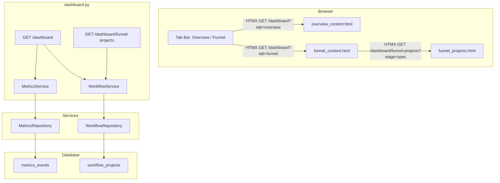

# Technical Design

## Metadata

| Field | Value |
|-------|-------|
| ID | 005 |
| Name | Dashboard Redesign — Two-Tab Layout with Workflow Funnel |
| Status | APPROVED |
| Author | Developer / AI-assisted |
| Reviewer | Tech Lead |
| Date | 2026-05-15 |
| Approved By | Tech Lead |
| Approval Date | 2026-05-15 |
| Jira Ticket | |

---

## Overview

The dashboard will be restructured from four separate Jinja2 pages (Overview, By Developer, By Model, By Command) into a single page with two HTMX-driven tabs: **Overview** and **Workflow Funnel**. The existing sidebar navigation stays but is simplified to reflect the two-tab model.

The **Overview tab** replaces the current stat cards with four new Figma-styled metric cards (Total Tokens, Total Cost, Avg Response Time, API Requests) including trend percentages computed against the prior period. Below the cards, two side-by-side Chart.js charts (line/area + bar) replace the single daily chart. A "Recent Activity" table below shows individual events with model badges.

The **Workflow Funnel tab** introduces a new `workflow_projects` database table and a corresponding repository/service layer. The funnel visualisation renders six horizontal bars matching the `.framework/steps/` pipeline (Spec → Design → UIX → Tasks → Implement → Review) with counts, percentages, and drop-off labels. A right-side stage selector uses HTMX to filter a "Recent Projects in {Stage}" table. Three summary stat cards (Active Projects, Avg Time in Stage, Blocked) sit between funnel and table.

All styling follows the design tokens extracted from Figma (see `FIGMA-REFERENCE.md`), using CSS custom properties in `base.html`. The existing dark theme remains but the colour palette, typography (Arimo/Inter/Liberation Mono), and spacing constants are updated to match the Figma designs exactly.

Per CONSTITUTION.md: repository pattern for all DB access, service layer for business logic, async/await throughout, Pydantic models for any new schemas, and `Depends()` for injection.

---

## Architecture

**Components affected:**

| Component | Change Type | Description |
|-----------|-------------|-------------|
| `models/db.py` | Modify | Add `WorkflowProject` ORM model for the `workflow_projects` table |
| `repositories/workflow_repo.py` | New | Repository for CRUD and aggregation queries on `workflow_projects` |
| `services/workflow_service.py` | New | Business logic for funnel counts, stage filtering, drop-off calculations, stat aggregation |
| `services/metrics_service.py` | Modify | Add `get_overview_with_trends()` method that computes current vs prior period for trend percentages; add `get_recent_events()` for the activity table |
| `repositories/metrics_repo.py` | Modify | Add `recent_events()` query returning individual events (Date, Model, Tokens, Cost, Duration); add `daily_token_counts()` for the token usage chart |
| `routers/dashboard.py` | Modify | Replace four route handlers with a single `/dashboard` route that serves both tabs via HTMX partials; remove `/dashboard/by-model`, `/dashboard/by-developer`, `/dashboard/by-command` |
| `templates/base.html` | Modify | Replace CSS custom properties with Figma design tokens; update font imports (Arimo, Inter, Liberation Mono); remove sidebar nav items for old pages |
| `templates/dashboard.html` | Modify | New page structure: shared header (title + subtitle + tab bar), `#tab-content` div for HTMX swaps |
| `templates/partials/overview_content.html` | New | Overview tab partial: 4 metric cards, 2 charts, activity table |
| `templates/partials/funnel_content.html` | New | Workflow Funnel tab partial: funnel bars, stage selector, stat cards, projects table |
| `templates/partials/funnel_projects.html` | New | HTMX partial for the stage-filtered projects table (swapped when stage selector is clicked) |
| `templates/partials/sidebar.html` | Modify | Remove By Developer, By Model, By Command links; keep Overview link only |
| `templates/partials/stat_cards.html` | Modify | Redesign to match Figma metric card style (30px bold values, trend text, icon containers) |
| `templates/.OLD/` | New | Directory to archive replaced templates (`by_model.html`, `by_developer.html`, `by_command.html`, `partials/by_model_content.html`, `partials/by_developer_content.html`, `partials/by_command_content.html`, `partials/stat_cards.html`, `partials/dashboard_content.html`) — moved here instead of deleted |
| `static/icons/` | New | SVG icon assets exported from Figma (already saved in spec assets, to be served via FastAPI `StaticFiles`) |



---

## Data Model

### New table: `workflow_projects`

Tracks specs/projects through framework stages for the Workflow Funnel tab.

| Column | Type | Nullable | Description |
|--------|------|----------|-------------|
| `id` | `Integer` PK | No | Auto-increment primary key |
| `spec_id` | `String(20)` UNIQUE | No | Spec identifier (e.g., "001", "005") |
| `name` | `String(255)` | No | Human-readable project name |
| `stage` | `String(50)` | No | Current stage: `spec`, `design`, `tasks`, `implement` |
| `status` | `String(50)` | No | Current status: `draft`, `in_progress`, `review`, `approved`, `blocked` |
| `entered_stage_at` | `DateTime` | No | When the project entered its current stage |
| `created_at` | `DateTime` | No | Row creation timestamp (server default `NOW()`) |
| `updated_at` | `DateTime` | No | Last update timestamp (server default `NOW()`, on-update `NOW()`) |

**Indexes:**
- `ix_workflow_projects_stage` on `stage` — stage-based filtering and funnel aggregation
- `ix_workflow_projects_status` on `status` — blocked count queries

**Stage values** (enum enforced at application layer, matching `.framework/steps/`):
- `spec` — step-01-spec: Specification phase
- `design` — step-02-design: Technical design phase
- `uix` — step-02b-uix: UI/UX specification phase
- `tasks` — step-03-tasks: Task breakdown phase
- `implement` — step-04-implement: Implementation phase
- `review` — step-05-review: Code review phase

**Status values** (enum enforced at application layer):
- `draft` — Initial creation
- `in_progress` — Actively being worked on
- `review` — Under review
- `approved` — Stage completed / approved
- `blocked` — Requires attention

---

## API / Interfaces

No new REST API endpoints are added. All changes are to the existing dashboard HTML routes.

### Modified routes

| Method | Path | Change |
|--------|------|--------|
| GET | `/dashboard` | Now accepts `?tab=overview\|funnel` query param. Returns full page on initial load, HTMX partial for tab switches. |
| GET | `/dashboard/funnel-projects` | **New** — HTMX-only endpoint. Accepts `?stage=spec\|design\|uix\|tasks\|implement\|review`. Returns `funnel_projects.html` partial. |
| GET | `/dashboard/by-model` | **Removed** — redirects to `/dashboard` |
| GET | `/dashboard/by-developer` | **Removed** — redirects to `/dashboard` |
| GET | `/dashboard/by-command` | **Removed** — redirects to `/dashboard` |

### Router changes in `dashboard.py`

The main `/dashboard` handler will:
1. Call `MetricsService.get_overview_with_trends(days)` for Overview tab data (stat card values + trends, daily token counts for line chart, model distribution for bar chart, recent events for table)
2. Call `WorkflowService.get_funnel_summary()` for Funnel tab data (stage counts, percentages, drop-off values, stage stats)
3. Determine which tab is active via `?tab=` param (default: `overview`)
4. For HTMX requests: return the relevant partial only
5. For full page loads: return `dashboard.html` with the active tab's partial embedded

The `/dashboard/funnel-projects` handler will:
1. Call `WorkflowService.get_projects_by_stage(stage)` to fetch filtered project list
2. Return `funnel_projects.html` partial (HTMX swap target)

### New service methods

**`MetricsService.get_overview_with_trends(days)`** — Returns:
```python
{
    "total_tokens": int,
    "total_tokens_trend_pct": float,      # vs prior period
    "total_cost_usd": float,
    "total_cost_trend_pct": float,
    "avg_duration_ms": float,
    "avg_duration_trend_delta": float,     # absolute delta in seconds
    "total_events": int,
    "total_events_trend_pct": float,
    "daily_token_counts": [{"date": str, "tokens": int}],
    "model_distribution": [{"model": str, "event_count": int}],
    "recent_events": [{"date": str, "model": str, "tokens": int, "cost": float, "duration_s": float}],
}
```

**`WorkflowService.get_funnel_summary()`** — Returns:
```python
{
    "stages": [
        {"name": "spec", "count": int, "percentage": float, "drop_off": int},
        {"name": "design", "count": int, "percentage": float, "drop_off": int},
        {"name": "uix", "count": int, "percentage": float, "drop_off": int},
        {"name": "tasks", "count": int, "percentage": float, "drop_off": int},
        {"name": "implement", "count": int, "percentage": float, "drop_off": int},
        {"name": "review", "count": int, "percentage": float, "drop_off": int},
    ],
    "total_projects": int,
    "conversion_rate_pct": float,
    "active_in_stage": int,           # for selected stage
    "avg_time_in_stage_days": float,
    "blocked_count": int,
}
```

**`WorkflowService.get_projects_by_stage(stage)`** — Returns:
```python
[
    {
        "spec_id": str,
        "name": str,
        "status": str,
        "time_in_stage_days": float,
    },
]
```

---

## Risks & Tradeoffs

| Risk / Tradeoff | Mitigation |
|-----------------|------------|
| **Funnel data requires manual population** — `workflow_projects` must be populated manually or via a future admin UI. The spec explicitly excludes automated filesystem scanning for v1. | Provide an Alembic migration that creates the table with sample seed data. Document the manual workflow for adding/updating projects. |
| **Removing four pages may break bookmarks** — Users who bookmarked `/dashboard/by-model` etc. will get redirects. | Add 302 redirect routes from old paths to `/dashboard` so existing bookmarks keep working. |
| **Trend calculation requires sufficient historical data** — If the database has less than 2× the selected period of data, trend percentages will be inaccurate or N/A. | Display "—" for trends when prior period data is insufficient (< 1 event in prior period). |
| **Chart.js bundle size** — Two charts on one page instead of one. | Chart.js is already loaded via CDN; no additional bundle cost. Both charts share the same instance. |

---

## Acceptance Criteria Traceability

| Acceptance Criterion | Addressed By |
|----------------------|--------------|
| Header shows subtitle + two tab buttons (Overview, Workflow Funnel) with icons | `templates/dashboard.html` — new header structure with Figma tab buttons; SVG icons from `static/icons/` |
| Tab switch without full page reload (HTMX partial swap) | `routers/dashboard.py` — `?tab=` param + `_is_htmx()` check; `hx-get` / `hx-target="#tab-content"` / `hx-swap="innerHTML"` on tab buttons |
| Overview: 4 stat cards with icons and green trend % | `templates/partials/overview_content.html` + `MetricsService.get_overview_with_trends()` computing current vs prior period deltas |
| Overview: Two side-by-side charts (line/area + bar) in purple/blue | `templates/partials/overview_content.html` — two Chart.js canvases; line chart for `daily_token_counts`, bar chart for `model_distribution`; colors from design tokens |
| Overview: Data table with Date, Model badge, Tokens, Cost, Duration | `templates/partials/overview_content.html` — `recent_events` table; model name in `<span>` with `#fafafa` bg badge |
| Funnel: 6 horizontal bars (Spec, Design, UIX, Tasks, Implement, Review) with counts and percentages | `templates/partials/funnel_content.html` — CSS horizontal bars with widths proportional to percentage; colours assigned per stage from design tokens; `WorkflowService.get_funnel_summary()` provides stage data |
| Funnel: Red "−N drop-off" between bars with arrows | `templates/partials/funnel_content.html` — drop-off labels with `color: #ff6467`; arrow SVGs between bars |
| Funnel: "Overall Conversion Rate" line with percentage and count | `templates/partials/funnel_content.html` — bottom section showing `conversion_rate_pct` and "N of M projects successfully implemented" |
| Funnel: Right-side stage selector with highlighted selection | `templates/partials/funnel_content.html` — 6 stage buttons (Spec, Design, UIX, Tasks, Implement, Review); active button bg `#fafafa`, inactive `#262626`; HTMX `hx-get` to `/dashboard/funnel-projects?stage=X` |
| Funnel: Stage selector click filters bottom table | `routers/dashboard.py` — `/dashboard/funnel-projects` endpoint; `WorkflowService.get_projects_by_stage(stage)`; HTMX swaps `#funnel-projects` |
| Funnel: 3 stat cards (Active Projects, Avg Time in Stage, Blocked) | `templates/partials/funnel_content.html` + `WorkflowService.get_funnel_summary()` returning `active_in_stage`, `avg_time_in_stage_days`, `blocked_count` |
| Funnel: Project rows with Spec ID, Status badge, Time in stage | `templates/partials/funnel_projects.html` — monospace SPEC-ID, color-coded status badge (blue for In Progress, amber for Review, red for Blocked), time in days |
| Visual: Color palette, card borders, typography, spacing match Figma | `templates/base.html` — CSS `:root` variables replaced with Figma design tokens from `assets/design-tokens.css`; font imports for Arimo, Inter, Liberation Mono |
| Responsive: Content usable at <1024px without horizontal scroll | `templates/base.html` — existing sidebar collapse media query retained; metric cards grid switches to 2-column; charts stack vertically; funnel + selector stack vertically |

---

## Open Questions

None — all resolved. See Risks & Tradeoffs for archived decisions:
- Old templates are moved to `templates/.OLD/` (not deleted) for reference during transition.
- Seed migration will include actual specs currently in `specs/` so the funnel has data from day one.
